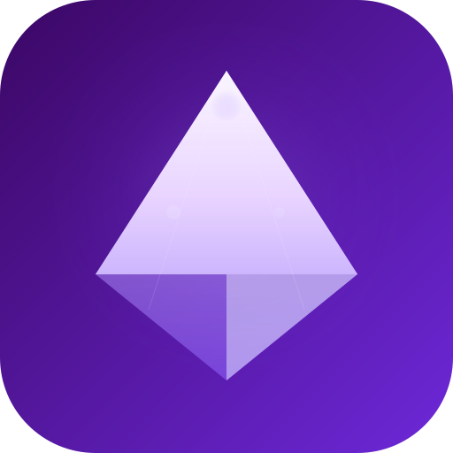

<div align="center">
  

  # Aura

  基于 React 18 的现代化组件库，为构建优雅的用户界面而生。

  [](https://github.com/AsBeforeLandy/aura/blob/main/LICENSE)
  [](https://github.com/AsBeforeLandy/aura/pulls)
  [](https://github.com/AsBeforeLandy/aura/stargazers)

  [快速开始](#安装) · [在线文档](https://asbeforelandy.github.io/aura) · [更新日志](docs/changelog.md) · [GitHub](https://github.com/AsBeforeLandy/aura) · [English](#english)

  
  
</div>

---

## 特性

- **💎 优雅设计** — Violet 紫罗兰色系主色调，精心调配的视觉体系
- **🌙 双模式主题** — 亮色柔和 + 暗色光晕，CSS Variables 驱动，支持运行时切换
- **🧩 34+ 组件** — 覆盖通用、表单、数据展示、反馈、导航、布局六大分类
- **🔒 TypeScript 优先** — 完整类型定义，所有 Props 均有详细 JSDoc 注释
- **⚡ React 18** — `forwardRef`、Compound Component 等 React 最新特性
- **♿ 无障碍** — 支持 `aria-*` 属性、键盘导航
- **🤖 AI 友好** — 内置 MCP Server，AI 助手可直接查询组件 API

## 兼容环境

| 浏览器 | 版本 |
| --- | --- |
| Chrome | 80+ |
| Firefox | 80+ |
| Safari | 14+ |
| Edge | 80+ |

## 安装

```bash
# pnpm（推荐）
pnpm add @aura/ui

# yarn
yarn add @aura/ui

# npm
npm install @aura/ui
```

## 使用

```tsx
import { Button, Space } from '@aura/ui';
import '@aura/ui/dist/index.css';

const App = () => (
  <Space>
    <Button variant="primary">开始使用</Button>
    <Button variant="outline">了解更多</Button>
  </Space>
);
```

### 主题切换

```tsx
import { ThemeProvider, useTheme } from '@aura/ui';

const App = () => (
  <ThemeProvider defaultTheme="light">
    <Content />
  </ThemeProvider>
);
```

## 组件一览

| 分类 | 组件 |
| --- | --- |
| **通用** | Button、Typography、Space、Divider |
| **表单** | Input、Textarea、Select、Checkbox、Radio、Switch |
| **数据展示** | Tag、Badge、Avatar、Tooltip、Card、Collapse、Tabs、Empty |
| **反馈** | Alert、Spin、Message、Notification、Result、Popconfirm |
| **导航** | Menu、Breadcrumb、Pagination、Steps、Dropdown |
| **表单高级** | Slider、Rate、Upload、Form |
| **布局** | Layout、Flex、Scrollbar |

## 包结构

```
aura/
├── packages/
│   ├── ui/        # @aura/ui — UI 组件库
│   ├── shared/    # @aura/shared — 工具函数（classNames、prefixCls 等）
│   ├── request/   # @aura/request — HTTP 请求封装
│   ├── cli/       # @aura/cli — MCP Server 与 CLI 工具
│   └── skill/     # AI 技能定义
├── docs/          # 文档站内容
└── public/        # 静态资源
```

## 开发

```bash
# 克隆仓库
git clone https://github.com/AsBeforeLandy/aura.git
cd aura

# 安装依赖
pnpm install

# 启动文档开发服务器
pnpm dev

# 运行测试
pnpm test

# 监听模式测试
pnpm test:watch

# 构建文档站
pnpm build

# 构建组件库
pnpm build:lib
```

## 链接

- [在线文档](https://asbeforelandy.github.io/aura)
- [更新日志](docs/changelog.md)
- [主题定制](docs/guide/theme.md)
- [GitHub Issues](https://github.com/AsBeforeLandy/aura/issues)

## 许可证

Aura 基于 [MIT License](https://github.com/AsBeforeLandy/aura/blob/main/LICENSE) 开源。

---

<div align="center">
  Copyright © 2026-present Aura Team
</div>
